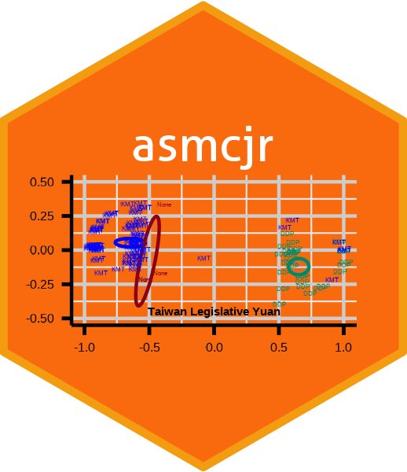

## asmcjr  <br /> 

[](https://github.com/uniofessex/asmcjr/actions/workflows/test-coverage.yaml)  
  
This package supports the book ["2nd Edition Analyzing Spatial Models of Choice and Judgment "](https://www.routledge.com/Analyzing-Spatial-Models-of-Choice-and-Judgment/II-Bakker-Carroll-Hare-Poole-Rosenthal/p/book/9781138715332).  In its second edition, much of the R code has been streamlined. This package contains all of the data and functions to replicate the analyses in the book. 

<br />
  
&nbsp;

## Installation
You will need lastest installation of [_R_](https://cran.r-project.org/mirrors.html) (preferably version 3.6 or above) and [RStudio](https://rstudio.com/products/rstudio/download/#download).  Visit [Installation](articles/installation.html) for further instructions.


<!-- README.md is generated from README.Rmd. Please edit that file -->

```{r, include = FALSE}
knitr::opts_chunk$set(
  collapse = TRUE,
  comment = "#>",
  fig.path = "man/figures/README-",
  out.width = "100%"
)
knitr::opts_chunk$set(echo = TRUE)
options(repos = c(CRAN = "https://cloud.r-project.org/"))
```

```
install.packages("devtools", dependencies=TRUE)
library(devtools)
devtools::install_github("uniofessex/asmcjr")
```


