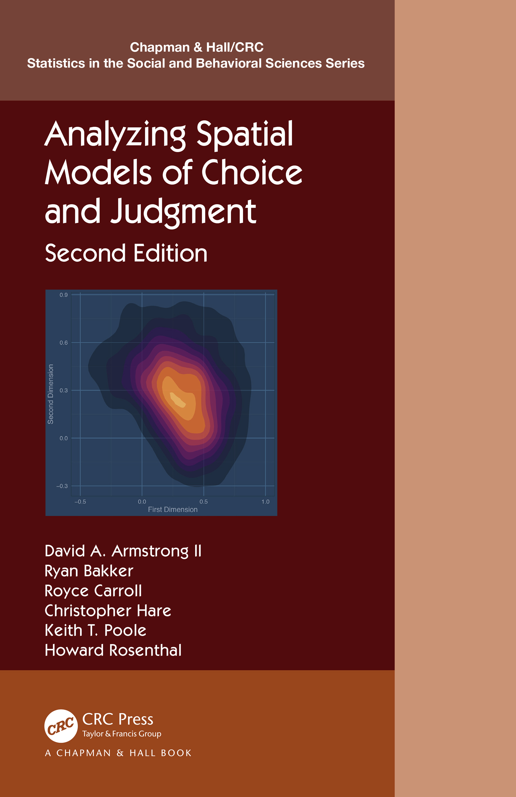

## asmcjr: Analyzing Spatial Models of Choice and Judgment

<!--     -->

This package supports the book [“2nd Edition: Analyzing Spatial Models
of Choice and
Judgment”](https://www.routledge.com/Analyzing-Spatial-Models-of-Choice-and-Judgment/II-Bakker-Carroll-Hare-Poole-Rosenthal/p/book/9781138715332).
In this second edition, much of the R code has been streamlined. The
package contains all of the data and functions necessary to replicate
the analyses presented in the book.

 
  
 

### Installation

You will need a stable installation of
[R](https://cran.r-project.org/mirrors.html) (preferably version
**4.4.1**) and
[RStudio](https://rstudio.com/products/rstudio/download/#download).
Visit [Installation](articles/installation.html) for further
instructions.

<!-- README.md is generated from README.Rmd. Please edit that file -->

    install.packages("devtools", dependencies=TRUE)
    library(devtools)
    devtools::install_github("uniofessex/asmcjr")
